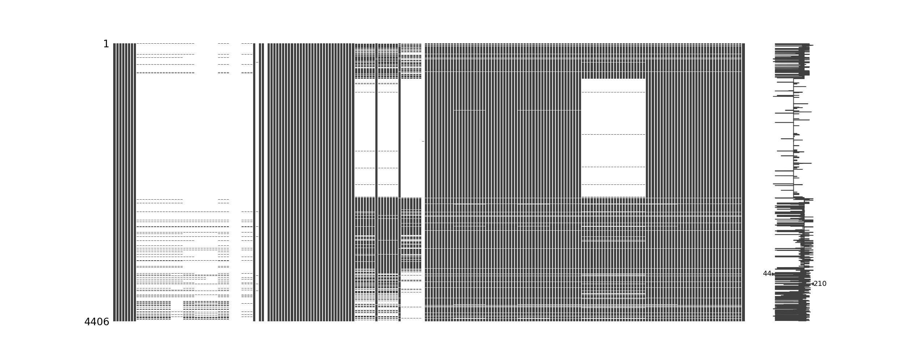

# py-LDMC(Linux Malware & Detection Classification) System

## Introduction

Malware is intrusive software designed to damage and destroys computer systems. The common types of malware include computer viruses, computer worms, Ransomware & Keyloggers. This malicious software may destroy crucial data or remove our access from it. Anti-malware is a computer program used to prevent, detect, and remove malware. This anti-malware software help in the detection and thereby prevention of attacks on systems. This project aims to provide an ML-based approach to increase the security of a system against such attacks by detecting the malicious software before any damage.

## Workflow -Our Approach

 - We have used supervised learning techniques to tackle this problem.
 - *Data Preparation* 
	 -  We uncompressed all the files which were provided to us after renaming them by their class-name.
	 - Now we cleaned the data by `cleaner.py` .
	 - Now the features are extracted from the files and saved in a CSV file. We added a last column  in this CSV named type which contains the class-name of the file. This became our target variable.
    - Then we cleaned the dataset by filling in missing values and other things.
 - *Model Training*
    -  We have used Random Forest Classifier to train our model.
    -  We generated training and test data using `train_test_split` function.
     - After the model is trained, we saved the model as `finalized_model.sav`.
  
  - *Model Testing*
	  -  We also tested the model on the test data.
      - Accuracy and F1 score of the model is calculated and can be viewed by un-commenting the training function.
      - The accuracy and F1 score are printed in the console.
   
   - *Generating the result*
	   -  The trained model is loaded, and we use the data from perfect.csv to predict the class-name of the files.
       -  File names with their respective predicted class-name is saved in `result.csv`.
  
  ## Code Snippets
  **TECH STACK - *PYTHON***
  - `Pandas`
  - `Numpy`
  - `Scikit-learn`
  - `csv`
  - `Pickle`
  - `Matplotlib`
  - `Pyelftools`
  - `Missingno`
  
> - **[Dataset generated for Training & Testing Model](https://drive.google.com/file/d/1Pw_SSamEhfkxr5xB5Z71sVFe2fiq99k9/view?usp=sharing](https://drive.google.com/file/d/1Pw_SSamEhfkxr5xB5Z71sVFe2fiq99k9/view?usp=sharing))**
> -  **[Result Sample](https://drive.google.com/file/d/1ZhPo_ylzg3VzFae5dGGgSSuhGOxJQKxB/view?usp=sharing](https://drive.google.com/file/d/1ZhPo_ylzg3VzFae5dGGgSSuhGOxJQKxB/view?usp=sharing))**
> - **[Structure of Elf File](https://drive.google.com/file/d/1l64jMKd9Qs8w_doOg4dIfAep7B9n9rXX/view?usp=sharing)**

***
> **The Driver Code**
```
try:
    info_dictionaries = []
    for filename in os.listdir(sys.argv[1]):
        info_dictionary = get_elf_info(sys.argv[1]+"/"+filename)
        info_dictionaries.append(info_dictionary)
    dict_to_csv(info_dictionaries, "raw_data.csv")
    clean_dataset()
    # train_model()
    predict_and_save()

except FileNotFoundError:
    print("specified files were not found...")

except FileNotFoundError:
    print("specified file was not found")
```


>  **Data & Target Selection**
```
filename = 'summary_mod2.csv'
df = pd.read_csv(filename)

df = df.drop(['file_name'], axis=1)

features = df.columns.values

csv_features = []
for i in features:
        csv_features.append(i)

data = df[features[:-1]]
target = df[features[-1]]

X = data
Y = target
```

> **Data Count & Visualization** - 
```
height = list(classes)
bars = ('benign', 'ddos', 'backdoor', 'botnet', 'virus', 'trojan')
y_pos = np.arange(len(bars))
plt.bar(y_pos, height, color=['green', 'red', 'blue', 'yellow', 'orange', 'purple'])
plt.xticks(y_pos, bars)
plt.xlabel('Classes')
plt.ylabel('Number of Samples')
plt.savefig('distribution_count.png')
plt.show()
```


> **Extracting Important Features** - 
```
model = ExtraTreesClassifier()
model.fit(X, Y)
# print(len(model.feature_importances_))

feature_ranking = {feature_value_pair[0]: feature_value_pair[1] for feature_value_pair in zip(features, model.feature_importances_)}
sorted_feature_ranking = {k:v for k,v in sorted(feature_ranking.items(), key=lambda item: item[1], reverse=True)}
sorted_features = sorted_feature_ranking.keys()
sorted_importance = sorted_feature_ranking.values()
df_features = pd.DataFrame(sorted_feature_ranking.items(), columns=['features', 'importance'])
n_features = X.shape[1]
plt.figure(figsize=(80, 80))
plt.barh(range(n_features), model.feature_importances_, align='edge')
plt.yticks(np.arange(n_features), X.columns.values)
plt.xlabel('Feature Importance')
plt.ylabel('Features')
plt.savefig('feature_importance.png', bbox_inches='tight')
```


> **Model Training & Prediction**
```
rf = RandomForestClassifier()
rf.fit(data_train, target_train)
pred = rf.predict(data_test)
```

> **Model Performance Statistics**
```
score = accuracy_score(target_test, pred, normalize=True)
print("F1 Score: {}%".format(f1_score(target_test, pred, average='macro')*100))
print("Accuracy: {}%".format(score*100))
```


> **Function For Data Cleaning**
Before:

```
def clean_dataset():
    features_list = ['file_name', 'file_size', ... 'section_shstrtab_sh_entsize']
    given_file = 'raw_data.csv'
    given_data = pd.read_csv(given_file)
    given_data_columns_list = []
    for i in given_data.columns.values:
            given_data_columns_list.append(i)
   ...
        for row in csv.DictReader(infile):
            writer.writerow(row)
    clean_data = pd.read_csv('examine_reordered.csv')
    clean_data['has_dwarf_info'] = clean_data['has_dwarf_info'].replace({True: 1, False: 0})
    ...
    clean_data['ehabi_infos'] = clean_data['ehabi_infos'].astype(bool).astype(int)

    clean_data.to_csv('perfect.csv', index=False)
```
After:


> **Prediction Using Saved Model**
```
def predict_and_save():
    ready_data = pd.read_csv('perfect.csv')
    results = pd.DataFrame(ready_data['file_name'])
    results["FILENAME"] = results["file_name"]
    results.drop(['file_name'], axis=1, inplace=True)
    ready_data.drop('file_name', axis=1, inplace=True)
    loaded_model = pickle.load(open('finalized_model.sav', 'rb'))
    results['CLASS'] = pd.DataFrame(loaded_model.predict(ready_data))
    results['CLASS'] = results['CLASS'].str.upper()
    results.to_csv('result.csv', index=False)
```

## Conclusion
Our Model successfully processes the malware given as a dataset and, we can classify different types of malware and take further steps to prevent them.
> **[Presentation Link](https://docs.google.com/presentation/d/1Mk74fCAoJLwHvBWooQ-2qPyLmZN0PlAO/edit?usp=sharing&ouid=112951210850980249860&rtpof=true&sd=true)**

> **[Video Demo Link](https://drive.google.com/file/d/1gxowVlmoFR9E2O3wRQmV-6HkN4q_O4IN/view?usp=sharing)**

> **TEAM DEBUGGERS**
> - [Aviral Srivastava](https://github.com/godofgeeks23)
> - [Prerna Choudhary](https://github.com/PRERNA-CHOUDHARY)
> - [Kartik Mehta](https://github.com/kartikmehta8)
